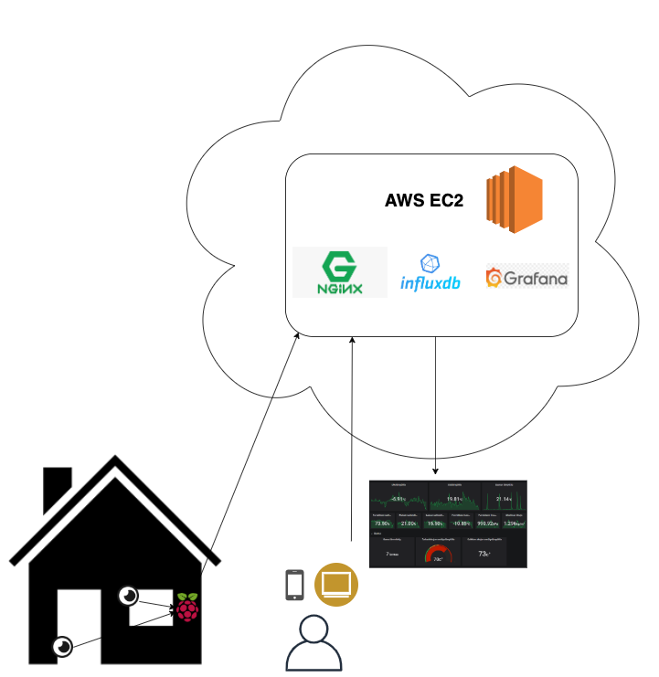

# AWS EC2 provisioning for Ruuvitag data
Project creates AWS infra using Terraform and provisions and configurates
EC2 instance with Nginx, Letsencrypt, Influxdb and Grafana using Ansible. This setup
is meant to be used for Ruuvitag data storage and visualization.

## Contents
- [AWS EC2 provisioning for Ruuvitag data](#aws-ec2-provisioning-for-ruuvitag-data)
  * [Prerequisites](#prerequisites)
    + [Data collector](#data-collector)
    + [AWS account](#aws-account)
    + [SSH key pair](#ssh-key-pair)
  * [Configuration](#configuration)
  * [Running](#running)
  * [Security](#security)
  * [Costs](#costs)



## Prerequisites

### Data collector
Data from Ruuvitags has to be collected and sent to Influxdb somehow. I use 
Raspberry Pi and Java client from [RuuviCollector](https://github.com/Scrin/RuuviCollector)
project which I run as a systemd service.
```
[Unit]
Description=Ruuvi Collector service

[Service]
User=pi
WorkingDirectory=/home/pi/ruuvi_collector/
ExecStart=/usr/bin/java -jar ruuvi-collector-0.2.jar
SuccessExitStatus=143
TimeoutStopSec=10
Restart=always
RestartSec=5

[Install]
WantedBy=multi-user.target
```
If you are using RuuviCollector you have to modify Influxdb address in
`ruuvi-collector.properties` file. Uncomment line starting with `influxUrl` and
enter you Influxdb address e.g. `https://your.domain:8086`. There are lot's of articles
about [setting up Raspberry Pi and Ruuvi Collector](https://pahkinablog.wordpress.com/2017/08/27/collecting-ruuvitag-measurements-and-displaying-them-with-grafana-install-notes/).

### AWS account
You have to have AWS account and IAM user with [programmatic access](https://www.teckriders.com/2019/05/create-aws-iam-user-with-programmatic-access/)
so that it can be used with Terraform. 

### SSH key pair
Create ssh key pair using `ssh-keygen` so that Ansible can connect to EC2 instance.

## Configuration
There are a few variables that you have to fill before Terraform file can be run:
* Variable in `user.tfvars.example` file (remove .example part after modification)
* Passwords and domain name (if you are using one) in Ansible role folders. Check
`main.yml` files in `vars` folders.

## Running
Use basic  [Terraform commands](https://www.terraform.io/docs/commands/index.html):
* `terraform init` 
* `terraform plan` 
* `terraform apply`

Ansible provisioning is started automatically after AWS infra is created. If you want
to run just Ansible part, use `ansible-playbook provision.yml`. 

## Security
Security in this solution is pretty poor and this setup should not be used
to store any sensitive data. For example database is exposed to internet which
should never be done in any "real" application. Ansible sets up Influxdb with user name
and password but it's not that much... If you have or are planning to 
implement more secure solution for sending Ruuvitag data to Influxdb through
internet please let me know. I might do it myself but probably not in any near future.

## Costs
I'm still eligible for [AWS free tier](https://aws.amazon.com/free/?all-free-tier.sort-by=item.additionalFields.SortRank&all-free-tier.sort-order=asc)
and last month's bill was $2.18 with tax. 1 $ for Route 53 and 0.75 $ for EC2 + tax. Route 53 is not needed if
you don't you domain name. When my 1 year free tier period is over price tag will be a little more, I'll update when
I know it. I tried to avoid costly AWS services and e.g. used Nginx instead of AWS load balancer.  
